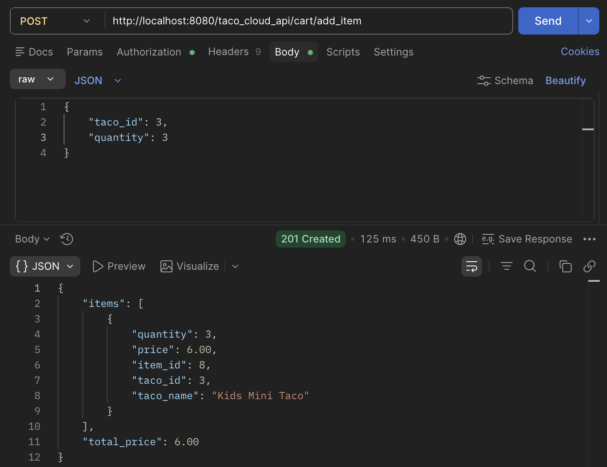
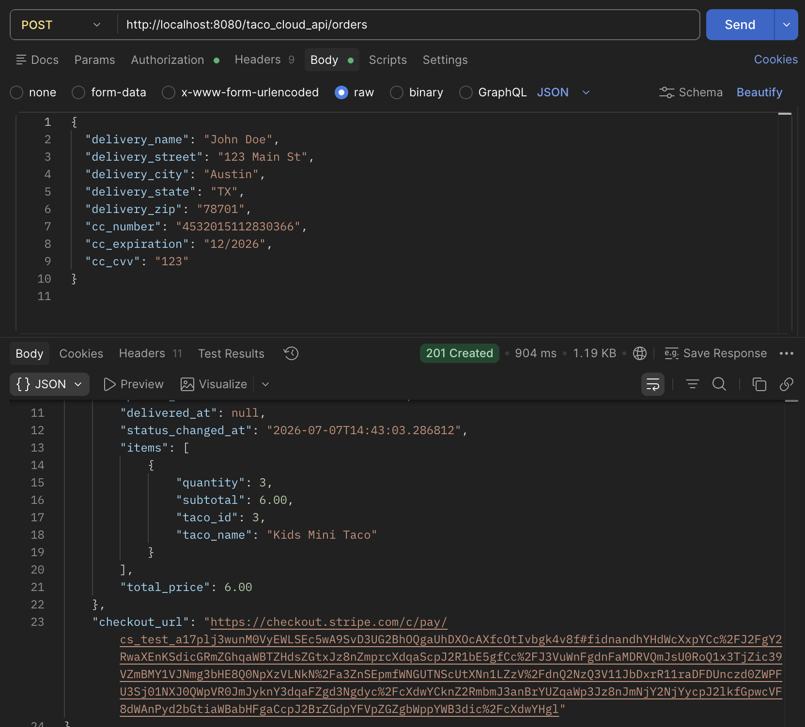

# 🌮 Taco Cloud

**Taco Cloud** by Craig Walls, **Spring in Action 6th edition**. During the course of this book an author creates a complete web application named __Taco Cloud__.
However, I decided to create an application with similar functionalities, but with focus on the REST architecture.
Not long ago acquired this book, so more new functionalities are on the way.

A __Taco Cloud__ is a RESTful backend API for a taco ordering, built with **Spring Boot 3.4.5**. Users can browse ingredients, build custom tacos, manage a shopping cart, check out with **Stripe**, and track their orders through a full lifecycle — all secured with JWT authentication and backed by automatic email notifications.
 
---

## ✨ Features

- User registration and login with **JWT-based authentication**
- Role-based access control (`USER`, `MANAGER`, `DEVELOPER`)
- CRUD operations for **Ingredients** and **Tacos**
- **Shopping cart** — add, update quantity, and remove taco items before checkout
- **Order lifecycle** with enforced status transitions (`AWAITING_PAYMENT` → `PREPARING` → `ON_THE_WAY` → `DELIVERED`, or `CANCELED`)
- **Stripe integration** — Stripe Customers created on registration, Checkout Sessions created on order placement, and payment tracking (`PENDING`, `COMPLETED`, `FAILED`)
- **Stripe webhooks** — `checkout.session.completed` and `checkout.session.expired` events automatically update payment and order status
- **Transactional email notifications** — order confirmation and order status update emails sent via Gmail SMTP, decoupled from the request/DB transaction using Spring's `ApplicationEventPublisher`
- Soft-delete support across all major entities
- Database migrations managed by **Liquibase**
- Pre-loaded seed data for quick local testing
---

## 🛠 Tech Stack

| Layer       | Technology                                  |
|-------------|---------------------------------------------|
| Framework   | Spring Boot 3.4.5                           |
| Language    | Java                                        |
| Security    | Spring Security 6 + JJWT 0.12.5             |
| Persistence | Spring Data JPA + Hibernate                 |
| Database    | MySQL 8/9                                   |
| Migrations  | Liquibase 4.29.2                            |
| Mapping     | MapStruct 1.6.3                             |
| Validation  | Jakarta Validation 3                        |
| Payments    | Stripe Java SDK                             |
| Email       | Spring Mail (`JavaMailSender`) + Gmail SMTP |
| Frontend    | html + Thymeleaf                            |
| Build       | Maven                                       |
 
---

## 🚀 Getting Started

### Prerequisites

- Java 17+
- MySQL 8+ running locally (or via Docker)
- Maven 3.8+
- A [Stripe](https://dashboard.stripe.com/) account (test mode is fine) and the [Stripe CLI](https://stripe.com/docs/stripe-cli) for local webhook forwarding
- A Gmail account with an [App Password](https://myaccount.google.com/apppasswords) for sending emails
### 1. Configure environment variables

Create a `.env` file in the project root (the app loads it automatically via `spring.config.import`):

```env
# Database
DATABASE_URL=jdbc:mysql://localhost:3306/taco_cloud
MYSQL_USER=your_db_user
MYSQL_PASSWORD=your_db_password
 
# JWT
JWT_SECRET=your_super_secret_key_at_least_256_bits
JWT_EXPIRATION=86400000
 
# Stripe
STRIPE_API_KEY=sk_test_your_stripe_secret_key
STRIPE_WEBHOOK_SECRET=whsec_your_webhook_signing_secret
 
# Mail (Gmail SMTP)
MAIL_USERNAME=your_gmail_address@gmail.com
MAIL_PASSWORD=your_gmail_app_password
APP_MAIL=your_gmail_address@gmail.com
```

### 2. Create the database

```sql
CREATE DATABASE taco_cloud;
```

### 3. Run the application

```bash
# Using Maven
mvn spring-boot:run
 
# Or using the pre-built JAR
java -jar taco-cloud-0_0_1-SNAPSHOT.jar
```

Liquibase will automatically run all migrations on startup, including creating tables and seeding test data.

### 4. Forward Stripe webhooks locally

Since the app runs under a non-root context path, make sure to include it when forwarding events:

```bash
stripe listen --forward-to localhost:8080/taco_cloud_api/webhook/stripe
```

Copy the signing secret printed by the CLI into `STRIPE_WEBHOOK_SECRET`.

### 5. Base URL

```
http://localhost:8080/taco_cloud_api
```
 
---

## 🔐 Authentication

All endpoints except `/auth/**` and `/webhook/**` require a valid JWT token in the `Authorization` header:

```
Authorization: Bearer <your_token>
```

### Seed test accounts

| Email | Password | Role |
|---|---|---|
| `bob@mail` | `password` | USER |
| `alice.developer1@mail.com` | `password` | USER, DEVELOPER |

> **Note:** Passwords in the database are BCrypt-hashed. The seed password shown above is a placeholder — update the DB seed data with your actual test password.
>
> Emails matching `*developer<n>@*` or `*manager<n>@*` are automatically granted the `DEVELOPER` or `MANAGER` role on registration.
 
---

## 📡 API Endpoints

### Auth — `/auth`

| Method | Path | Description | Auth Required |
|---|---|---|---|
| POST | `/auth/register` | Register a new user (creates a Stripe Customer and an empty cart) | No |
| POST | `/auth/login` | Login and receive a JWT token | No |

### Ingredients — `/ingredient`

| Method | Path | Description | Auth Required |
|---|---|---|---|
| GET | `/ingredient` | List all ingredients (optionally filter by `type`) | Yes |
| GET | `/ingredient/{id}` | Get ingredient by ID | Yes |
| POST | `/ingredient` | Create a new ingredient | DEVELOPER |
| PATCH | `/ingredient/{id}` | Update an ingredient | DEVELOPER |
| DELETE | `/ingredient/{id}` | Delete an ingredient | DEVELOPER |

### Tacos — `/taco`

| Method | Path | Description | Auth Required |
|---|---|---|---|
| GET | `/taco` | List all tacos | Yes |
| GET | `/taco/{id}` | Get taco by ID | Yes |
| POST | `/taco` | Create a new taco | DEVELOPER |
| PATCH | `/taco/{id}` | Update a taco | DEVELOPER |
| DELETE | `/taco/{id}` | Delete a taco | DEVELOPER |

### Cart — `/cart`

| Method | Path | Description | Auth Required |
|---|---|---|---|
| GET | `/cart` | Get the current user's cart | Yes |
| GET | `/cart/{userId}` | Get a cart by user ID | DEVELOPER, MANAGER |
| POST | `/cart/add_item` | Add a taco to the current user's cart (or increase quantity) | Yes |
| PATCH | `/cart/update_quantity/{itemId}` | Update a cart item's quantity (`0` removes it) | Yes |
| DELETE | `/cart/remove_item/{itemId}` | Remove an item from the current user's cart | Yes |

### Orders — `/orders`

| Method | Path | Description | Auth Required |
|---|---|---|---|
| POST | `/orders` | Place an order from the current cart and create a Stripe Checkout Session | Yes |
| GET | `/orders/last` | Get the current user's most recent order | Yes |
| GET | `/orders/{orderId}` | Get order by ID | DEVELOPER, MANAGER |
| GET | `/orders/my` | Get the current user's orders (optionally filter by `status`) | Yes |
| GET | `/orders/user/{userId}` | Get orders for a specific user (optionally filter by `status`) | DEVELOPER, MANAGER |
| PATCH | `/orders/update/{orderId}` | Update an order's status (enforces allowed transitions) | DEVELOPER, MANAGER |

Order status flow:

```
AWAITING_PAYMENT → PREPARING → ON_THE_WAY → DELIVERED
        ↓               ↓            ↓
     CANCELED       CANCELED     CANCELED
```

### Payments — `/payments`

| Method | Path | Description | Auth Required |
|---|---|---|---|
| GET | `/payments/last` | Get the current user's most recent payment | Yes |
| GET | `/payments` | Get the current user's payments (optionally filter by `status`) | Yes |
| GET | `/payments/order/{orderId}` | Get the payment for a specific order | DEVELOPER, MANAGER |
| GET | `/payments/user/{userId}` | Get payments for a specific user (optionally filter by `status`) | DEVELOPER, MANAGER |
| GET | `/payments/success` | Thymeleaf redirect page after a successful Stripe Checkout | No |
| GET | `/payments/cancel` | Thymeleaf redirect page after a canceled Stripe Checkout | No |

### Webhook — `/webhook`

| Method | Path | Description | Auth Required |
|---|---|---|---|
| POST | `/webhook/stripe` | Receives and verifies Stripe events (`checkout.session.completed`, `checkout.session.expired`) | No |
 
---

## 💳 Payment Flow

1. On registration, a **Stripe Customer** is created for the user and stored as `stripeCustomerId`.
2. The user adds tacos to their **cart** (`/cart/add_item`).
3. Placing an order (`POST /orders`) converts the cart into an `Order` (`AWAITING_PAYMENT`), clears the cart, creates a `Payment` (`PENDING`), and returns a Stripe **Checkout Session URL**.
4. The user completes payment on Stripe's hosted checkout page.
5. Stripe sends a webhook event to `/webhook/stripe`:
    - `checkout.session.completed` → `Payment` set to `COMPLETED`, `Order` set to `PREPARING`, and an order confirmation email is published.
    - `checkout.session.expired` → `Payment` set to `FAILED`, `Order` set to `CANCELED`, and a status update email is published.
6. Emails are sent **after** the database transaction commits (`@TransactionalEventListener(phase = AFTER_COMMIT)`), so a failed email never rolls back an order or payment update.
---

## 📧 Email Notifications

Transactional emails are sent via Gmail SMTP using Spring's `JavaMailSender`. Two events are handled:

- **Order confirmation** — sent when a Stripe payment completes
- **Order status update** — sent whenever an order's status changes (including cancellation and manual updates by staff)
  Sending is decoupled from the triggering transaction: services publish an `OrderCreatedEvent` / `OrderStatusChangedEvent` via `ApplicationEventPublisher`, and a listener picks them up `AFTER_COMMIT` to send the mail, so a slow or failed SMTP call can never block or roll back an order/payment update.

---

## 🗄 Database Model


Key tables:

- `users` — account info (name, email, address, phone, Stripe customer ID)
- `roles` — `USER`, `MANAGER`, and `DEVELOPER` roles
- `user_role` — many-to-many join between users and roles
- `ingredients` — individual taco ingredients
- `tacos` — custom taco creations, linked to ingredients via `taco_ingredient`
- `carts` — one active cart per user
- `cart_items` — taco + quantity line items belonging to a cart
- `orders` — customer orders with delivery info and status, linked to items via `order_items`
- `order_items` — taco + quantity + subtotal snapshot for a placed order
- `payments` — Stripe session/customer IDs, amount, and status, linked to a user and an order
---

## 📁 Project Structure

```
src/
└── main/
    └── java/ihromovyi/tacocloud/
        ├── client/          # Stripe API client (MyStripeClient)
        ├── config/          # Configurations (Security, Stripe, Web)
        ├── controller/      # REST controllers (Auth, Cart, Ingredient, Taco, Order, Payment, Webhook, ...)
        ├── dto/             # Request/Response DTOs, event DTOs
        ├── exception/       # Custom exceptions
        ├── mapper/          # MapStruct mappers
        ├── model/           # JPA entities (User, Role, Taco, Cart, CartItem, Order, OrderItem, Payment, ...)
        ├── repository/      # Spring Data JPA repositories
        ├── security/        # JWT filter, AuthenticationService, UserDetailsService
        ├── service/         # Business logic layer (cart, order, payment, mail, ingredient, taco, user)
        ├── validation/      # Custom validators (e.g. password)
        └── webhook/         # Stripe webhook handling
    └── resources/
        ├── application.properties
        ├── templates/       # home.html, payment-success.html, payment-cancel.html, mail templates
        ├── static/pictures/
        └── db/changelog/    # Liquibase migration files
```

---

## Endpoints Examples

### Failed Registration
User has to write a password with at least 1 capital letter, 1 lowercase letter and a special sign, else receives a BAD_REQUEST.


### Login Success

Successful login with JWT token received.


### Get all Ingredients


### Update Ingredient by ID


### Add Item To Cart



### Place Order 



### Get last Payment


## 🤝 Contributing

If you have any interesting suggestion on how to make the application more interesting
you are welcome to make pull request.  

---
