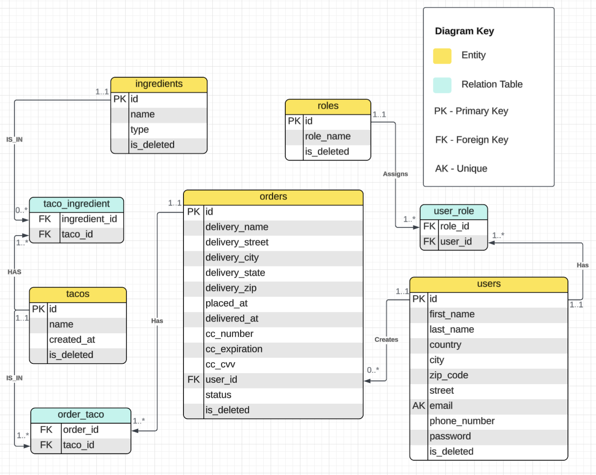
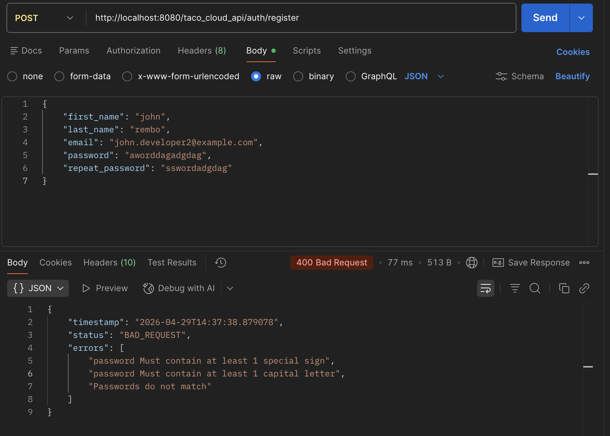
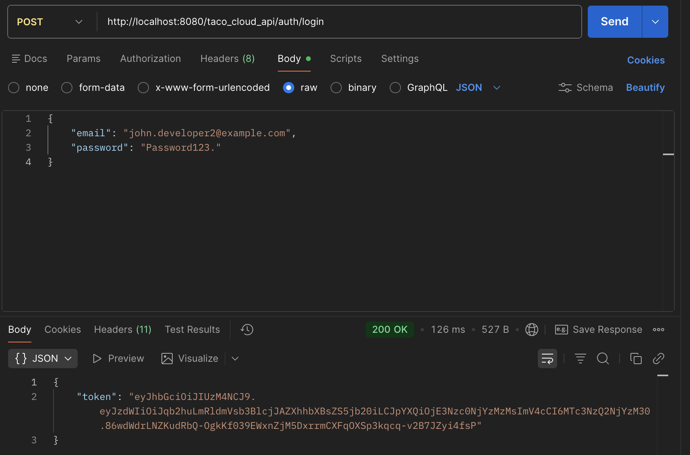
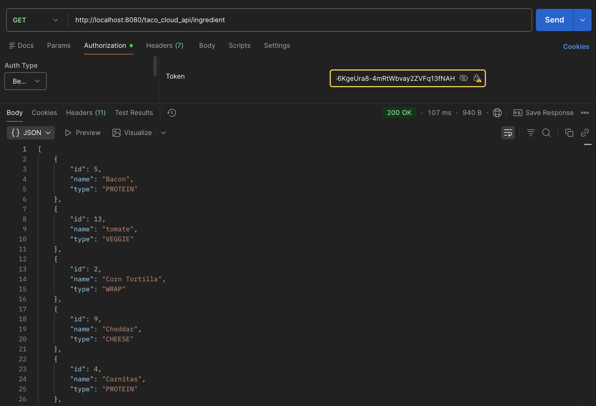
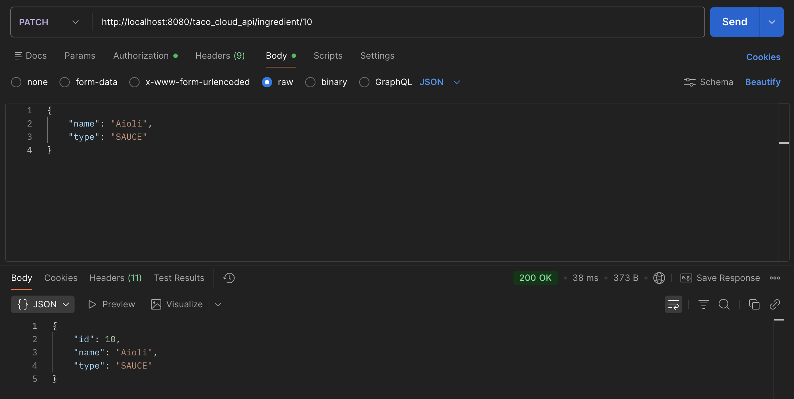
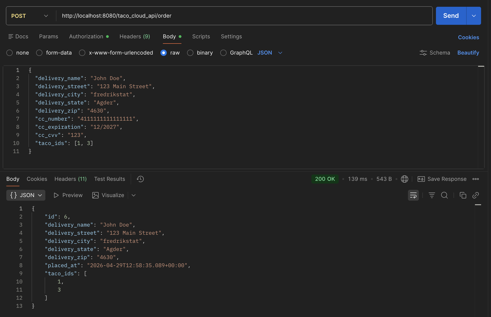

# 🌮 Taco Cloud

**Taco Cloud** by Craig Walls, **Spring in Action 6th edition**. During the course of this book an author creates a complete web application named __Taco Cloud__.
However, I decided to create an application with similar functionalities, but with focus on the REST architecture.
Not long ago acquired this book, so more new functionalities are on the way. 

A __Taco Cloud__ is RESTful backend API for a taco ordering, built with **Spring Boot 3.4.5**. Users can browse ingredients, build custom tacos, place orders, and manage their accounts — all secured with JWT authentication.

---

## ✨ Features

- User registration and login with **JWT-based authentication**
- Role-based access control (`USER`, `DEVELOPER`)
- CRUD operations for **Ingredients**, **Tacos**, and **Orders**
- Order lifecycle tracking with statuses (e.g. `PREPARING`)
- Soft-delete support across all major entities
- Database migrations managed by **Liquibase**
- Pre-loaded seed data for quick local testing

---

## 🛠 Tech Stack

| Layer | Technology |
|---|---|
| Framework | Spring Boot 3.4.5 |
| Language | Java |
| Security | Spring Security 6 + JJWT 0.12.5 |
| Persistence | Spring Data JPA + Hibernate |
| Database | MySQL 9 |
| Migrations | Liquibase 4.29.2 |
| Mapping | MapStruct 1.6.3 |
| Validation | Jakarta Validation 3 |
| Build | Maven |

---

## 🚀 Getting Started

### Prerequisites

- Java 17+
- MySQL 8+ running locally (or via Docker)
- Maven 3.8+

### 1. Configure environment variables

Create a `.env` file in the project root (the app loads it automatically via `spring.config.import`):

```env
DATABASE_URL=jdbc:mysql://localhost:3306/taco_cloud
MYSQL_USER=your_db_user
MYSQL_PASSWORD=your_db_password
JWT_SECRET=your_super_secret_key_at_least_256_bits
JWT_EXPIRATION=86400000
```

### 2. Create the database

```sql
CREATE DATABASE taco_cloud;
```

### 3. Run the application

```bash
# Using Maven
mvn spring-boot:run

# Or using the pre-built JAR
java -jar taco-cloud-0_0_1-SNAPSHOT.jar
```

Liquibase will automatically run all migrations on startup, including creating tables and seeding test data.

### 4. Base URL

```
http://localhost:8080/taco_cloud_api
```

---

## 🔐 Authentication

All endpoints except `/auth/**` require a valid JWT token in the `Authorization` header:

```
Authorization: Bearer <your_token>
```

### Seed test accounts

| Email | Password | Role |
|---|---|---|
| `bob@mail` | `password` | USER |
| `alice.developer1@mail.com` | `password` | USER, DEVELOPER |

> **Note:** Passwords in the database are BCrypt-hashed. The seed password shown above is a placeholder — update the DB seed data with your actual test password.

---

## 📡 API Endpoints

### Auth — `/auth`

| Method | Path | Description | Auth Required |
|---|---|---|---|
| POST | `/auth/register` | Register a new user | No |
| POST | `/auth/login` | Login and receive a JWT token | No |

### Ingredients — `/ingredient`

| Method | Path | Description |
|---|---|---|
| GET | `/ingredient` | List all ingredients |
| GET | `/ingredient/{id}` | Get ingredient by ID |
| POST | `/ingredient` | Create a new ingredient |
| PUT | `/ingredient/{id}` | Update an ingredient |
| DELETE | `/ingredient/{id}` | Delete an ingredient |

### Tacos — `/taco`

| Method | Path | Description |
|---|---|---|
| GET | `/taco` | List all tacos |
| GET | `/taco/{id}` | Get taco by ID |
| POST | `/taco` | Create a new taco |
| PUT | `/taco/{id}` | Update a taco |
| DELETE | `/taco/{id}` | Delete a taco |

### Orders — `/order`

| Method | Path | Description |
|---|---|---|
| GET | `/order` | Get all orders for the authenticated user |
| GET | `/order/{id}` | Get order by ID |
| POST | `/order` | Place a new order |
| PUT | `/order/{id}` | Update an order |
| DELETE | `/order/{id}` | Cancel/delete an order |

---

## 🗄 LogiPhysical Database Model



Key tables:

- `users` — stores account info (name, email, address, phone)
- `roles` — `USER` and `DEVELOPER` roles
- `user_role` — many-to-many join between users and roles
- `ingredients` — individual taco ingredients
- `tacos` — custom taco creations, linked to ingredients
- `orders` — customer orders with delivery info and payment details, linked to tacos via `order_taco`

---

## 📁 Project Structure

```
src/
└── main/
    └── java/ihromovyi/tacocloud/
        ├── controller/      # REST controllers (Auth, Ingredient, Taco, TacoOrder)
        ├── service/         # Business logic layer
        ├── repository/      # Spring Data JPA repositories
        ├── model/           # JPA entities (User, Role, Taco, TacoOrder, ...)
        ├── dto/             # Request/Response DTOs
        ├── mapper/          # MapStruct mappers
        ├── security/        # JWT filter, AuthenticationService, UserDetailsService
        ├── config/          # SecurityConfig, WebConfig, MapperConfig
        ├── exception/       # Custom exceptions
        └── validation/      # Custom validators (e.g. password)
    └── resources/
        ├── application.properties
        ├── templates/home.html
        ├── static/pictures/
        └── db/changelog/    # Liquibase migration files
```

---

## Endpoints Examples

### Failed Registration
User has to write a password with at least 1 capital letter, 1 lowercase letter and a special sign, else receives a BAD_REQUEST.


### Login Success

Successful login with JWT token received.


### Get all ingredients



### Update Ingredient by ID



### Create Order




## 🤝 Contributing

If you have any interesting suggestion on how to make the application more interesting
you are welcome to make pull request.  

---
